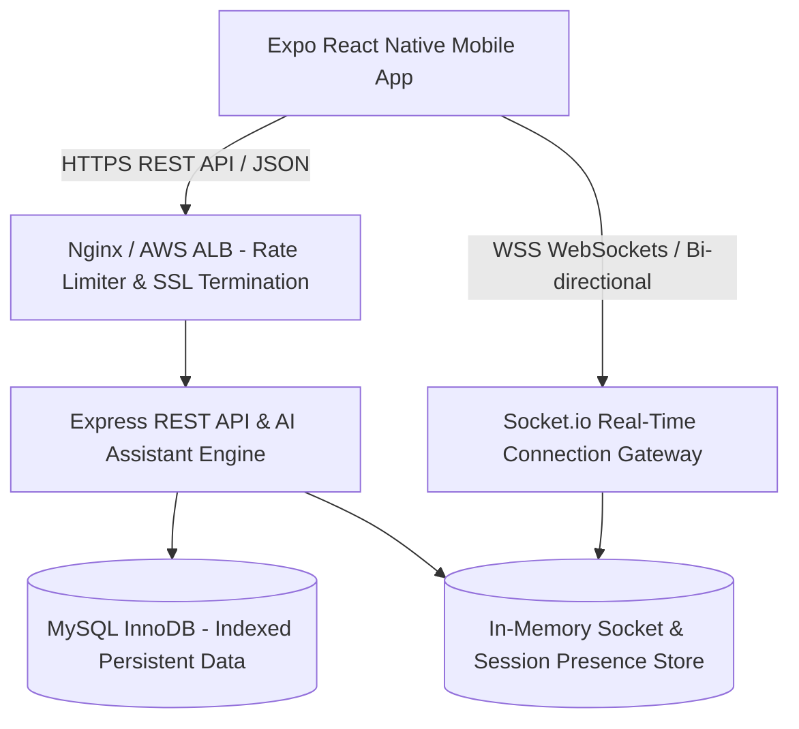
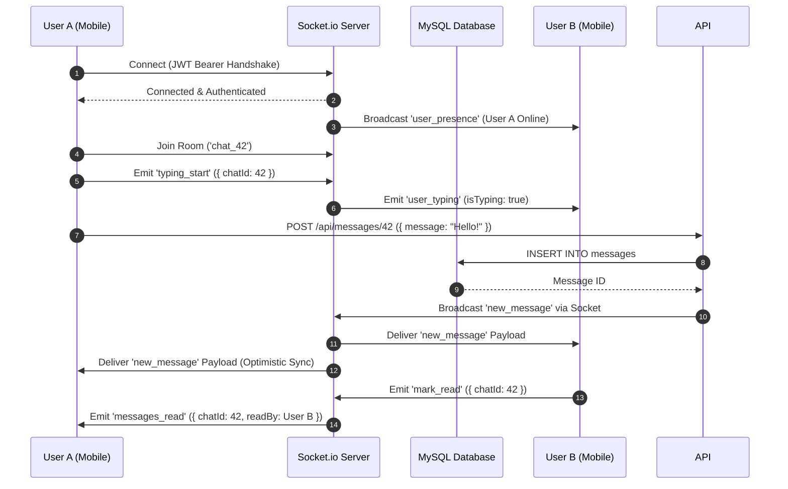
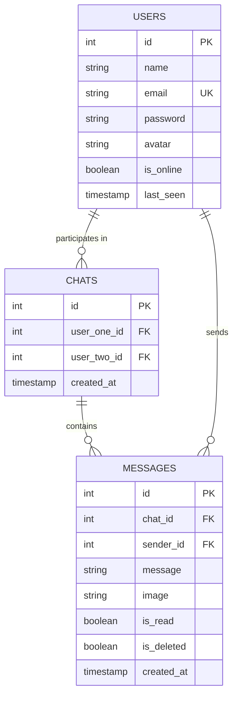

# Enterprise System Architecture & Engineering Blueprint

This document details the high-level architecture, design patterns, security threat models, and data flow models for the **ChatApp Real-Time Enterprise Mobile Ecosystem**.

---

## 🏛 1. High-Level C4 System Container Diagram

---

## ⚡ 2. WebSocket Real-Time Event State Machine

---

## 🔒 3. Security Threat Model & Defense In Depth

| Threat Vector | Mitigation Strategy | Implementation Location |
| :--- | :--- | :--- |
| **Brute Force Login** | IP Rate-limiting (max 20 requests per 15 min) | [authRoutes.js](file:///d:/HDP%20REACT%20PROJECT/App/ChatAppBackend/routes/authRoutes.js) |
| **HTTP Header Tampering** | Security Headers (CSP, HSTS, Frameguard, X-XSS) | `helmet()` in [server.js](file:///d:/HDP%20REACT%20PROJECT/App/ChatAppBackend/server.js) |
| **Session Interception** | Server-side JWT Blacklist Revocation on Logout | [auth.js](file:///d:/HDP%20REACT%20PROJECT/App/ChatAppBackend/middleware/auth.js) |
| **SQL Injection** | Parameterized MySQL queries (`mysql2/promise`) | All Controllers |
| **Stored XSS** | HTML entity sanitization on string inputs | `sanitize()` in [messageController.js](file:///d:/HDP%20REACT%20PROJECT/App/ChatAppBackend/controllers/messageController.js) |
| **Database Bloat & DoS** | Static file upload service with file type/size limits | [upload.js](file:///d:/HDP%20REACT%20PROJECT/App/ChatAppBackend/middleware/upload.js) |

---

## 🗄 4. Database Schema & Indexing Blueprint

### High-Performance Indexing Strategy:
1. `idx_messages_chat_id_created ON messages(chat_id, id DESC)`: Enables sub-millisecond cursor pagination (`LIMIT 30 OFFSET 0` or `WHERE id < beforeId`).
2. `uq_chat_users ON chats(user_one_id, user_two_id)`: Guarantees unique 1-to-1 conversation pairs.

---

## 🤖 5. AI Assistant & Observability Architecture

1. **AI Smart Quick Reply Engine**: Analyzes conversation intent and returns contextually appropriate smart reply suggestions.
2. **Interactive OpenAPI / Swagger Documentation**: Available at `/api-docs` for real-time API exploration.
3. **Observability Metrics**: Exposed at `/api/health` providing real-time memory usage, CPU load averages, DB latency, and active WebSocket connection gauges.
