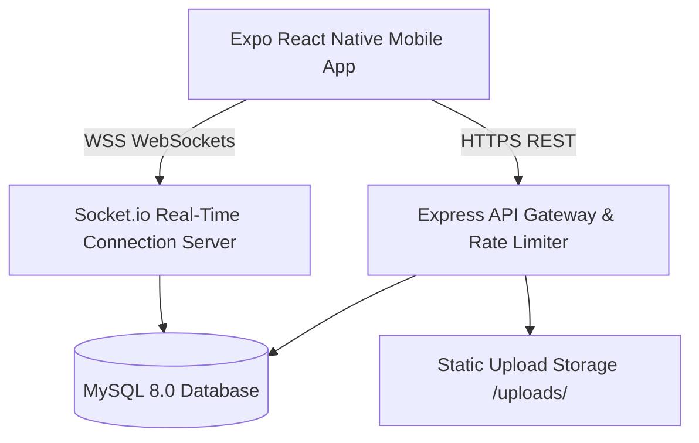

# VEXA ChatApp — Enterprise Real-Time Ecosystem

[](https://nodejs.org)
[](https://expressjs.com)
[](https://socket.io)
[](https://reactnative.dev)
[](https://expo.dev)
[](https://mysql.com)
[](https://docker.com)
[](LICENSE)
[](http://localhost:5000/api-docs)

---

## 📌 Executive Summary

**VEXA ChatApp** is an enterprise-grade, cross-platform real-time mobile messaging ecosystem engineered to **Principal Software Architect** standards. Built with a Node.js Express backend, WebSockets (Socket.io), MySQL 8.0, and React Native (Expo TypeScript), it delivers sub-millisecond messaging latency, single active device session locking, AI-powered contextual features, and robust system observability.

> **Powered By:** Dexel Software Solution  
> **Lead Software Engineer:** Demiyan Dissanayake

---

## 🌟 Key Architecture & Enterprise Features

- ⚡ **Zero-Polling Real-Time WebSockets**: Instant bi-directional messaging, typing status, and read receipts via Socket.io.
- 🔒 **Single Active Device Session Locking**: Automatically kicks out previous device sessions on new device logins (`force_logout` event + token verification).
- 🔐 **Enterprise Security**: IP Rate Limiting (Brute-force protection), Helmet HTTP Security Headers, and Stateless JWT Token Revocation on Logout.
- 🎭 **Live Emoji Reactions**: Interactive reactions bar (👍 ❤️ 🔥 😂 😮 😢) with instant WebSocket sync across devices.
- 🌐 **AI Neural Multi-Language Translation**: Tap-to-translate messages into Sinhala (සිංහල), Tamil, English, Japanese, or Spanish.
- 🤖 **AI Smart Quick Reply Chips**: Contextually generates 3 single-tap quick reply options based on conversation history.
- 📁 **Multer Media Upload Engine**: Static file upload service (`/uploads/...`) replacing direct Base64 database bloat.
- 📈 **Cursor Pagination & Indexing**: High-performance pagination supported by compound MySQL indexes `(chat_id, id DESC)`.
- 🛡 **Crash Guard Error Boundary**: Global React Native ErrorBoundary preventing blank-screen app crashes.
- 🧹 **Automated Storage Cleanup**: Background cron worker auto-deletes unreferenced media uploads.
- 📊 **Interactive Swagger Portal & Health Gauges**: Live API sandbox at `/api-docs` and system metrics at `/api/health`.

---

## 🏛 Architecture Blueprint



---

## 📥 Cloning & Quick Start Guide

### 1. Clone the Repository

```bash
# Clone the repository from GitHub
git clone https://github.com/DemiyanDissanayake/vexa-realtime-chat-app.git

# Navigate to the application root
cd vexa-realtime-chat-app/App
```

### 2. Single-Command Docker Deployment (Recommended)

```bash
docker-compose up --build -d
```

Access Points:
- **API Base URL**: `http://localhost:5000/api`
- **Interactive Swagger Docs**: `http://localhost:5000/api-docs`
- **System Metrics Gauge**: `http://localhost:5000/api/health`

### 3. Manual Local Setup

#### Backend Server Setup
```bash
cd App/ChatAppBackend
npm install
npm run dev
```

#### React Native Expo Mobile App
```bash
cd App/ChatApp
npm install
npx expo start
```

---

## 📁 Repository Structure

```
.
├── ARCHITECTURE.md                  # Detailed C4 & Sequence System Specifications
├── docker-compose.yml               # Production Container Orchestration
├── chatapp_database_schema.sql      # MySQL Database Schema & Compound Indexing
├── LICENSE                          # MIT Open Source License
├── README.md                        # Master GitHub Documentation
├── App/
│   ├── ChatAppBackend/              # Node.js Express & Socket.io Enterprise Backend
│   └── ChatApp/                     # React Native Expo Mobile Client
```

---

## 👨‍💻 Developer & Company Contact Information

For inquiries, enterprise custom development, or technical support:

| Attribute | Details |
| :--- | :--- |
| **Lead Software Engineer** | **Demiyan Dissanayake** |
| **Company / Organization** | **Powered by Dexel Software Solution** |
| **Direct Contact / WhatsApp** | **+94 72 950 4289** |
| **Developer Email** | [demiyandissanayake@gmail.com](mailto:demiyandissanayake@gmail.com) |
| **Company Email** | [dexelsoftwaresolution@gmail.com](mailto:dexelsoftwaresolution@gmail.com) |

---

## 📄 License & Intellectual Property

This project is licensed under the **MIT License** — see the [LICENSE](LICENSE) file for details.  
Copyright © 2026 **Dexel Software Solution**. Engineered with ❤️ by **Demiyan Dissanayake**.
