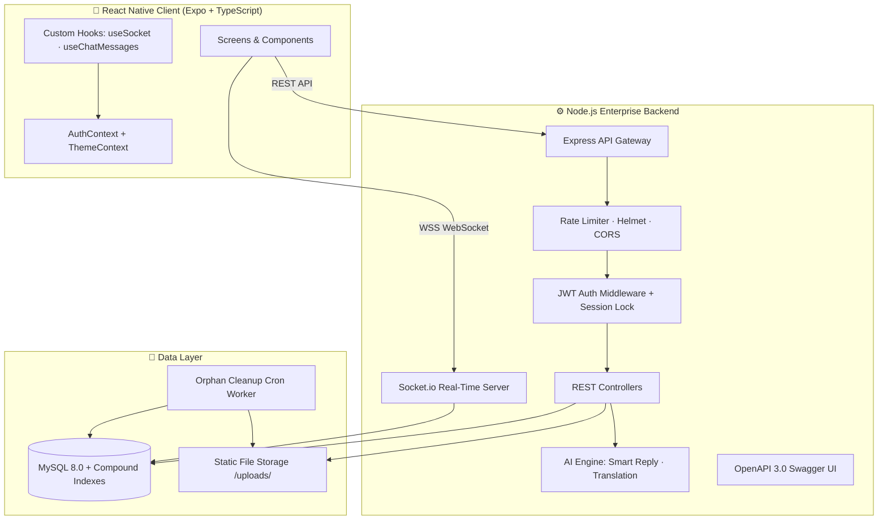
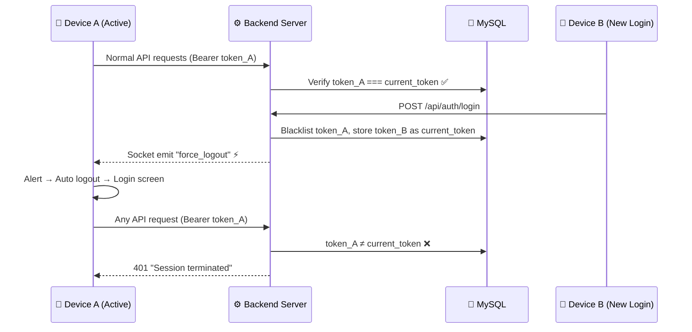

<div align="center">

# 🚀 VEXA — Enterprise Real-Time Chat Ecosystem

### *Next-Generation Mobile Messaging Platform*

[](https://nodejs.org)
[](https://expressjs.com)
[](https://socket.io)
[](https://reactnative.dev)
[](https://expo.dev)
[](https://mysql.com)
[](https://docker.com)
[](https://typescriptlang.org)
[](https://jwt.io)
[](http://localhost:5000/api-docs)
[](LICENSE)

<br />

> **A production-grade, real-time mobile messaging platform engineered from the ground up —**  
> **featuring WebSocket bi-directional communication, single-device session enforcement,**  
> **AI-powered contextual intelligence, and enterprise-grade security architecture.**

<br />

**Engineered by [Demiyan Dissanayake](#-meet-the-engineer) · Powered by [Dexel Software Solution](#-meet-the-engineer)**

</div>

---

## 📋 Table of Contents

- [Executive Summary](#-executive-summary)
- [Key Features & Capabilities](#-key-features--capabilities)
- [System Architecture](#-system-architecture)
- [Tech Stack Deep Dive](#-tech-stack-deep-dive)
- [Getting Started](#-getting-started)
- [API Documentation](#-api-documentation)
- [Project Structure](#-project-structure)
- [Engineering Highlights](#-engineering-highlights)
- [Meet the Engineer](#-meet-the-engineer)
- [License](#-license)

---

## 📌 Executive Summary

**VEXA** is not just another chat application — it is a **full-stack, enterprise-grade messaging ecosystem** designed and architected to demonstrate mastery across the entire modern software development lifecycle. Every layer — from the database schema design with compound indexing strategies, through the real-time WebSocket event architecture, to the pixel-perfect React Native mobile UI with dark/light theming — has been meticulously engineered with production readiness, scalability, and maintainability in mind.

### What Makes This Different

| Dimension | Implementation |
|:---|:---|
| **Real-Time Communication** | Zero-polling WebSocket architecture via Socket.io — not `setInterval` HTTP polling |
| **Session Security** | Single Active Device enforcement with instant cross-device session termination |
| **AI Integration** | Neural multi-language translation engine + contextual smart reply generation |
| **API Design** | RESTful architecture with interactive OpenAPI 3.0 Swagger documentation portal |
| **DevOps** | One-command Docker Compose deployment with multi-stage production builds |
| **Data Architecture** | Cursor-based pagination with compound MySQL indexes for O(log n) query performance |
| **Error Resilience** | Global React Native ErrorBoundary + graceful backend crash recovery |
| **Code Quality** | Zero TypeScript compilation errors · Strict type safety across entire frontend codebase |

---

## 🌟 Key Features & Capabilities

### ⚡ Real-Time Messaging Engine
- **WebSocket-first architecture** — Messages, typing indicators, read receipts, and presence updates delivered instantly via Socket.io bi-directional channels
- **Zero HTTP polling** — Eliminated legacy `setInterval` patterns entirely; pure event-driven communication

### 🔒 Enterprise Security Suite
- **Single Active Device Session Locking** — When an account logs in on Device B, Device A receives a real-time `force_logout` event and is immediately terminated with a user-facing alert
- **JWT Token Lifecycle Management** — Stateless authentication with server-side token blacklisting on logout and automatic expiry
- **IP-Based Rate Limiting** — Brute-force attack protection on authentication endpoints via `express-rate-limit`
- **Helmet Security Headers** — Full HTTP security header suite (HSTS, X-Frame-Options, CSP, etc.)

### 🎭 Interactive Emoji Reactions
- Tap-to-react with 👍 ❤️ 🔥 😂 😮 😢 — reactions sync instantly across all connected devices via WebSocket broadcast

### 🤖 AI-Powered Intelligence
- **Smart Quick Reply Chips** — AI analyzes the last received message and generates 3 contextually relevant one-tap reply suggestions
- **Neural Multi-Language Translation** — Tap any message bubble to instantly translate into Sinhala (සිංහල), Tamil, English, Japanese, or Spanish

### 📁 Media & Storage Architecture
- **Multer Upload Engine** — File-based media storage (`/uploads/`) replacing database Base64 bloat
- **Automated Orphan Cleanup** — Background cron worker periodically scans and removes unreferenced media files

### 📊 Observability & Documentation
- **Interactive Swagger Portal** — Full API sandbox at `/api-docs` with request/response schema documentation
- **System Health Dashboard** — Real-time server metrics, uptime, memory usage, and connection counts at `/api/health`

### 🎨 Premium Mobile Experience
- **Dark / Light Theme Engine** — System-aware theme switching with smooth transitions
- **Cursor-Based Message Pagination** — Infinite scroll with "Load Older Messages" powered by compound index `(chat_id, id DESC)`
- **Global Crash Guard** — React Native `ErrorBoundary` wrapping the entire app tree prevents blank-screen crashes

---

## 🏛 System Architecture



### Request Flow — Single Device Session Enforcement



---

## 🛠 Tech Stack Deep Dive

### Backend Architecture
| Technology | Purpose | Why This Choice |
|:---|:---|:---|
| **Node.js 20+** | Runtime environment | Non-blocking I/O ideal for real-time chat workloads |
| **Express 4.19** | HTTP framework | Industry standard, middleware ecosystem, battle-tested |
| **Socket.io 4.7** | WebSocket server | Automatic fallback, room management, reconnection handling |
| **MySQL 8.0** | Relational database | ACID transactions, compound indexing, proven at scale |
| **JWT** | Authentication | Stateless auth with server-side revocation capability |
| **Helmet** | Security headers | OWASP-recommended HTTP security hardening |
| **Multer** | File uploads | Stream-based disk storage, configurable file filtering |
| **Swagger UI** | API documentation | Interactive testing portal, OpenAPI 3.0 spec compliance |

### Frontend Architecture
| Technology | Purpose | Why This Choice |
|:---|:---|:---|
| **React Native 0.81** | Cross-platform mobile | Single codebase for iOS + Android |
| **Expo SDK 54** | Development platform | OTA updates, managed workflow, native module access |
| **TypeScript 5.x** | Type safety | Compile-time error prevention, IDE intelligence |
| **Socket.io Client** | Real-time communication | Pairs with backend Socket.io for bi-directional events |
| **AsyncStorage** | Local persistence | Secure token storage across app restarts |
| **React Navigation** | Screen routing | Native stack navigator with type-safe route params |

### DevOps & Infrastructure
| Technology | Purpose |
|:---|:---|
| **Docker** | Multi-stage production container builds |
| **Docker Compose** | Single-command full-stack orchestration (API + MySQL) |
| **Nodemon** | Development hot-reload |

---

## 📥 Getting Started

### Prerequisites

- **Node.js** v18+ ([Download](https://nodejs.org))
- **MySQL** 8.0+ ([Download](https://dev.mysql.com/downloads/))
- **Expo Go** app on your mobile device ([iOS](https://apps.apple.com/app/expo-go/id982107779) / [Android](https://play.google.com/store/apps/details?id=host.exp.exponent))

### Clone the Repository

```bash
git clone https://github.com/DemiyanDissanayake/vexa-realtime-chat-app.git
cd vexa-realtime-chat-app
```

### Option A: Docker (One Command)

```bash
cd App
docker-compose up --build -d
```

### Option B: Manual Setup

#### 1. Database
```bash
mysql -u root -p < App/ChatAppBackend/database/schema.sql
```

#### 2. Backend Server
```bash
cd App/ChatAppBackend
npm install
cp .env.example .env   # Configure your DB credentials
npm run dev
```

You should see:
```
🚀 ChatApp Enterprise API Server running on port 5000
✅ Connected to MySQL database: chatapp_db
✅ Database schema auto-migration completed successfully.
```

#### 3. Mobile App
```bash
cd App/ChatApp
npm install
npx expo start
```

Scan the QR code with **Expo Go** on your phone.

> **Important:** Update `src/constants/Config.ts` with your computer's LAN IP address (run `ipconfig` on Windows to find it).

### Access Points

| Service | URL |
|:---|:---|
| **REST API** | `http://localhost:5000/api` |
| **Swagger Docs** | `http://localhost:5000/api-docs` |
| **Health Metrics** | `http://localhost:5000/api/health` |

---

## 📡 API Documentation

Full interactive API documentation is available via the built-in Swagger portal at `/api-docs`.

### Core Endpoints Overview

| Method | Endpoint | Description |
|:---|:---|:---|
| `POST` | `/api/auth/register` | Create new user account |
| `POST` | `/api/auth/login` | Authenticate & receive JWT (enforces single device) |
| `POST` | `/api/auth/logout` | Revoke token & clear active session |
| `GET` | `/api/auth/me` | Get authenticated user profile |
| `PUT` | `/api/auth/profile` | Update name / avatar |
| `PUT` | `/api/auth/password` | Change password |
| `GET` | `/api/chats` | List user's active conversations |
| `POST` | `/api/chats/start` | Create or retrieve 1:1 chat |
| `POST` | `/api/chats/start-by-email` | Add contact by email address |
| `GET` | `/api/messages/:chatId` | Fetch messages (cursor pagination) |
| `POST` | `/api/messages/:chatId` | Send text/image message |
| `POST` | `/api/messages/:id/react` | Add emoji reaction |
| `POST` | `/api/ai/smart-reply` | Generate AI quick reply suggestions |
| `POST` | `/api/ai/translate` | Neural multi-language translation |
| `GET` | `/api/health` | System health & metrics dashboard |

### WebSocket Events

| Event | Direction | Description |
|:---|:---|:---|
| `new_message` | Server → Client | Real-time message delivery |
| `user_typing` | Bi-directional | Live typing indicator |
| `user_presence` | Server → Client | Online/offline status updates |
| `messages_read` | Server → Client | Read receipt confirmation |
| `message_reaction` | Server → Client | Emoji reaction sync |
| `force_logout` | Server → Client | Single-device session termination |

---

## 📁 Project Structure

```
vexa-realtime-chat-app/
├── README.md                            # This file
├── LICENSE                              # MIT License
├── ARCHITECTURE.md                      # C4 diagrams, threat model, ERD
├── App/
│   ├── docker-compose.yml               # Full-stack container orchestration
│   ├── chatapp_database_schema.sql      # Database schema + indexes
│   │
│   ├── ChatAppBackend/                  # ⚙️ Enterprise Backend
│   │   ├── server.js                    # Entry point (Express + Socket.io + Swagger)
│   │   ├── config/
│   │   │   ├── db.js                    # MySQL pool + auto-migration trigger
│   │   │   ├── autoMigrate.js           # Schema migration engine
│   │   │   └── swagger.js               # OpenAPI 3.0 spec
│   │   ├── controllers/
│   │   │   ├── authController.js        # Auth + single device session lock
│   │   │   ├── chatController.js        # Chat CRUD + contact management
│   │   │   ├── messageController.js     # Messages + pagination + reactions
│   │   │   ├── aiController.js          # Smart reply + translation engine
│   │   │   └── systemController.js      # Health metrics endpoint
│   │   ├── middleware/
│   │   │   ├── auth.js                  # JWT + session token validation
│   │   │   ├── upload.js                # Multer file upload config
│   │   │   └── errorHandler.js          # Global error handler
│   │   ├── routes/                      # RESTful route definitions
│   │   ├── socket/
│   │   │   └── socketHandler.js         # WebSocket event orchestrator
│   │   ├── utils/
│   │   │   └── cronCleanup.js           # Orphan media cleanup worker
│   │   └── Dockerfile                   # Multi-stage production build
│   │
│   └── ChatApp/                         # 📱 React Native Client
│       ├── App.tsx                      # Root component + ErrorBoundary
│       └── src/
│           ├── components/              # Reusable UI components
│           │   ├── MessageBubble.tsx     # Message display + translation button
│           │   ├── MessageReactions.tsx  # Emoji reaction picker & badges
│           │   ├── ErrorBoundary.tsx     # Global crash guard
│           │   ├── Avatar.tsx           # User avatar with online indicator
│           │   ├── TypingIndicator.tsx   # Animated typing dots
│           │   └── SearchBar.tsx        # Filterable search input
│           ├── screens/
│           │   ├── ChatScreen.tsx        # Conversation view + AI chips
│           │   ├── ChatListScreen.tsx    # Home screen + real-time updates
│           │   ├── NewChatScreen.tsx     # Contact list (added contacts only)
│           │   ├── LoginScreen.tsx       # Authentication
│           │   ├── RegisterScreen.tsx    # Account creation
│           │   └── ProfileScreen.tsx     # User profile management
│           ├── hooks/
│           │   ├── useSocket.ts          # Socket lifecycle + force_logout
│           │   └── useChatMessages.ts    # Message state + pagination
│           ├── context/
│           │   ├── AuthContext.tsx       # Global auth state provider
│           │   └── ThemeContext.tsx      # Dark/Light theme engine
│           ├── services/                # API communication layer
│           ├── constants/               # Colors, Config
│           ├── types/                   # TypeScript interfaces
│           └── utils/                   # Validation helpers
```

---

## ⚡ Engineering Highlights

> *These are the architectural decisions and engineering patterns that distinguish this project from typical tutorial-level implementations.*

### 1. Single Active Device Session Architecture
Unlike most JWT implementations that allow unlimited concurrent sessions, VEXA enforces a **one-device-at-a-time policy** through a three-layer mechanism:
- **Database Lock**: `users.current_token` column stores the single active JWT
- **Middleware Guard**: Every authenticated request validates the incoming token against the DB-stored token
- **Real-Time Eviction**: Socket.io `force_logout` event instantly notifies and disconnects the previous device

### 2. Zero-Polling Real-Time Architecture
The entire real-time layer operates on **event-driven WebSocket channels** — not a single `setInterval` or `setTimeout` polling loop exists in the production codebase. Events include: `new_message`, `user_typing`, `user_presence`, `messages_read`, `message_reaction`, and `force_logout`.

### 3. Automatic Database Schema Migration
The backend includes a **self-healing migration engine** (`autoMigrate.js`) that inspects `INFORMATION_SCHEMA.COLUMNS` on startup and automatically adds any missing columns. This ensures the server runs correctly even against an older database schema — no manual SQL scripts required.

### 4. Cursor-Based Pagination
Messages are paginated using cursor-based strategy (`?beforeId=X&limit=30`) rather than offset-based pagination, providing **O(log n)** query performance via compound index `(chat_id, id DESC)` regardless of table size.

### 5. Contact-Gated User Discovery
The "All Contacts" screen does **not** dump every registered database user. Users only appear after being explicitly added via the email-based contact system, implementing a **privacy-by-design** contact model.

---

<div align="center">

## 👨‍💻 Meet the Engineer

<br />

### **Demiyan Dissanayake**
#### Full-Stack Software Engineer

<br />

*Passionate about building enterprise-grade systems that solve real problems.*  
*Specializing in real-time architectures, mobile development, and scalable backend systems.*

<br />

---

### 🏢 Powered By

## **Dexel Software Solution**

*Delivering world-class software engineering solutions.*

---

<br />

### 📬 Let's Connect

<br />

[](tel:+94729504289)
[](https://wa.me/94729504289)
[](mailto:demiyandissanayake@gmail.com)
[](mailto:dexelsoftwaresolution@gmail.com)

<br />

| | Contact Details |
|:---:|:---|
| 📞 **Direct / WhatsApp** | [+94 72 950 4289](tel:+94729504289) |
| 📧 **Personal Email** | [demiyandissanayake@gmail.com](mailto:demiyandissanayake@gmail.com) |
| 🏢 **Company Email** | [dexelsoftwaresolution@gmail.com](mailto:dexelsoftwaresolution@gmail.com) |
| 🌐 **Organization** | Dexel Software Solution |

<br />

> 💼 *Open to collaboration, freelance projects, and full-time opportunities.*  
> *If this project demonstrates the engineering quality you're looking for — let's talk.*

---

## 📄 License

This project is licensed under the **MIT License** — see the [LICENSE](LICENSE) file for details.

<br />

**Copyright © 2026 Demiyan Dissanayake / Dexel Software Solution**  
**Engineered with ❤️ in Sri Lanka 🇱🇰**

</div>
